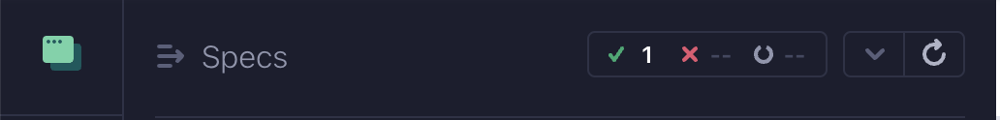

# DevOpsProject

  


The live deployment of the website through the GitHub Actions CI Pipeline is available [here: https://plugnpush.github.io/DevOpsProject/](https://plugnpush.github.io/DevOpsProject/).

## Project Description

This project is a simple web application that imitate Twitter. The application is built using React.js and express.js. The application has for only purpose to demonstrate a deployment pipeline using GitHub Actions and GitHub Pages. Also comes with a Discord Webhook integration.

## Run the project 

See the `README.md` of the following packages : `my-app` and `server`.

## Bonus :

### Shell Script Test

We implemented a shell script to test if the home page answered with the code 200. The file is at the root of the project
and is called ``check-script.sh``. It returns 1 and a print if the page answers with anything except 200.

To run the shell script, run the following command :

```shell
bash ./check-script.sh
```

### Cypress Test

We implemented a cypress test to check that the page is connected (200 answered) and the front element is present. We 
checked the main page elements.

To run cypress, run the following commands :
```shell
cd ./my-app
npx cypress open
```

Then pick EC2 Testing, then Chrome and click on "Start E2E Testing in Chrome". Finally, click on "basic-test". The test
is then running. If everything was ok, on the top left of the page you should see the picture the green cross. As follow :


You can also launch the tests by command line :

Which will lead to the following image :

```shell
cd ./my-app
npx cypress run
```


We can see that all tests passed (we have only one `basic-test.cy.js`).
